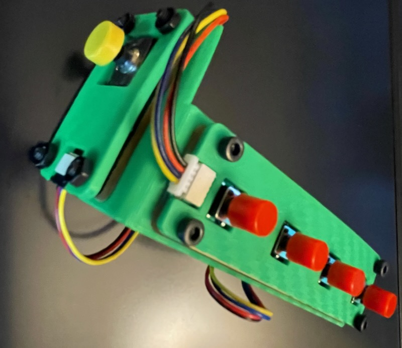
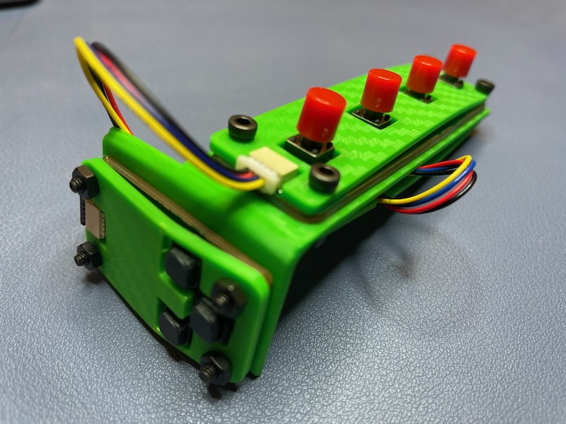
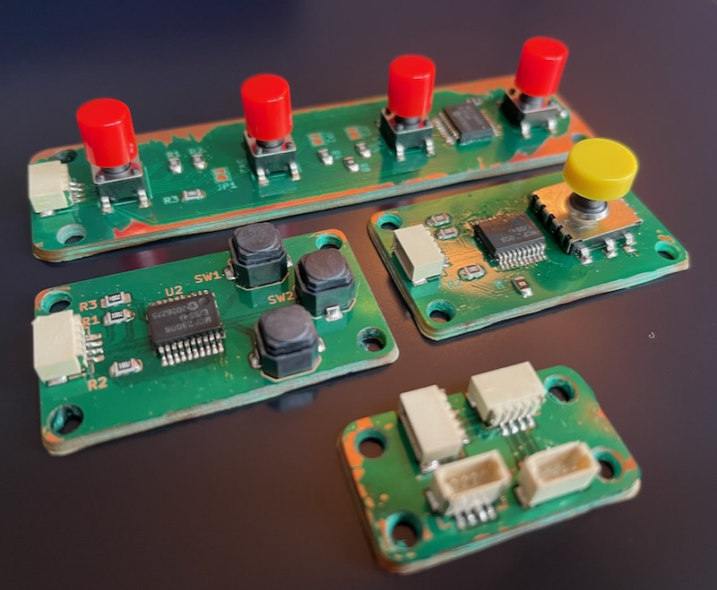
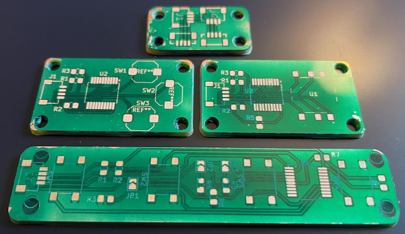

5wayjoy
---

Tactile 5 way joystick used in combination with:

* [micro-chorder](https://github.com/mikeysklar/micro-chorder) - One handed chording keyboard which combines 4 I2C boards
* [old-softie](https://github.com/mikeysklar/old-softie) -  3 soft silicon buttons I2C STEMMA
* [5wayjoy](https://github.com/mikeysklar/5wayjoy) - 5 way tactile joystick I2C STEMMA

An addition I2C hub and controller is used to run the CircuitPython code needed to translate chords into ascii chars.

